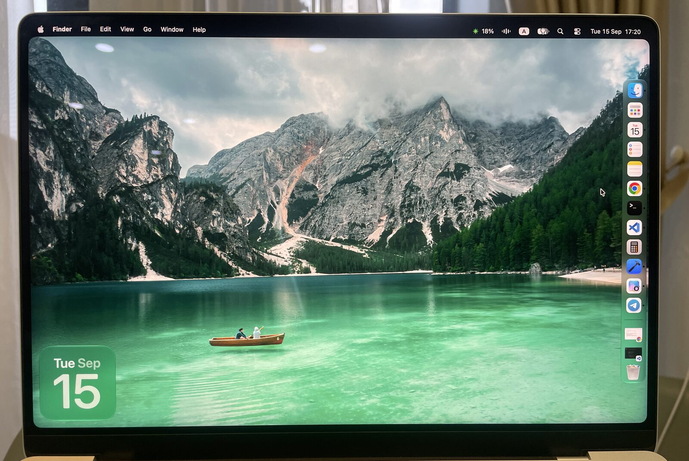

# norch

Hides the MacBook notch by baking it into your wallpaper: the menu bar strip is
painted solid black so the notch disappears into it, and the picture below is
clipped to a rounded rectangle matching the corner radius macOS gives windows.

One Swift script, no dependencies, nothing running in the background.



*Photographed rather than screenshotted on purpose — a screenshot cannot show the notch, so it cannot show it being hidden either.*

## Why this exists

I used [TopNotch](https://topnotch.app) for years. On 15 September 2026 I updated
to macOS 27 and it stopped working. The author replied quickly and said a fix was
coming, but a couple of weeks out — fair enough for a free app, and too long to
stare at the notch.

So I asked Claude to write a replacement instead of waiting. It took about three
rounds of "not quite". The first version rounded the corners of the black bar,
which is invisible, instead of the corners of the picture below it. The second
had the strip three pixels short of where windows begin, which left a seam of
wallpaper above every window — the exact thing the tool is supposed to remove.
Both were caught by screenshotting the desktop and reading the pixel values down
a column, which turned out to be a better reviewer than my eyes.

The result does less than TopNotch: no menu bar, no live preview, no per-display
handling. It writes an image file. That happens to be all I wanted.

## Requirements

- macOS 27 — the only version this has been built and checked against
- Xcode Command Line Tools, for `swift`: `xcode-select --install`

## Usage

```sh
./norch.swift photo.jpg              # writes photo-norch.png next to the input
./norch.swift photo.jpg out.png      # explicit output path
./norch.swift photo.jpg --set        # write it and apply it as the desktop picture
```

Re-run it whenever you pick a new wallpaper.

There is nothing to configure, on this Mac or on any other. Screen size, backing
scale, how far down windows begin and the window corner radius are all read from
AppKit at run time.

## How it decides what to draw

**The strip is sized to your windows, not to the notch.** These are not the same
number, and the notch is the smaller one — on a 14" MacBook Pro the notch is
28.5 pt tall while windows start at 29 pt. Size the strip to the notch and you
get a seam of wallpaper above every window, which is the thing you were trying to
get rid of. norch takes the top of `visibleFrame` and adds a point of slack: the
overshoot hides under the window where nobody can see it, and the seam cannot
open up.

**It renders at `points x backingScaleFactor`,** the resolution macOS composites
the desktop at. Rendering at the panel's native pixel count — 3024 x 1964 on this
machine, against 2704 x 1756 of composited desktop — looks like the sharper
choice, but then the OS rescales the result and the one-pixel edges this relies
on turn to mush.

**The corner radius comes from a real window.** It is read off a freshly created
`NSWindow` through `_cornerRadius`, which is private, so there is a fallback to
the macOS 27 value of 16 pt if it ever disappears. Hardcoding it would mean
getting it wrong the next time Apple changes the look.

**A one-pixel black hairline runs down the left, right and bottom edges.**
Without it the antialiased tail of a rounded corner leaves a faint line of colour
at the very edge of the screen, next to the matching corner of a window.

## Notes

- **Other macOS versions.** Everything here was measured on macOS 27 on a 14"
  MacBook Pro. Nothing is hardcoded to either, so other machines and older
  releases may well work — they just have not been tried. Reports welcome.
- **Multiple displays.** norch measures and applies to the main screen, the one
  with the menu bar on it.
- **Macs without a notch** get a wallpaper with a black menu bar strip and
  rounded corners, which is a look, but not the point of this.
- **Earlier versions of this repo** did the same work with a shell script driving
  ImageMagick, plus two helpers to read the screen constants and check them by
  hand. `git log` has them if you would rather not install Xcode.

## License

MIT
